# WebSocket V2 Data Flow Diagram

## System Architecture Visualization

### High-Level Data Flow

```mermaid
flowchart TB
    subgraph "Kraken Exchange"
        KWS[WebSocket V2 Server<br/>wss://ws-auth.kraken.com/v2]
        KREST[REST API Server<br/>https://api.kraken.com]
    end
    
    subgraph "Data Layer"
        WSM[Enhanced WebSocket Manager<br/>- Multiple Connections<br/>- Channel Priority<br/>- Auto Reconnect]
        RESTC[Strategic REST Client<br/>- Circuit Breaker<br/>- Rate Limiting<br/>- Minimal Usage]
        UDF[Unified Data Feed<br/>- Source Selection<br/>- Caching<br/>- Failover Logic]
    end
    
    subgraph "Processing Layer"
        MP[Message Processor<br/>- Format Conversion<br/>- Validation<br/>- Batching]
        SM[State Manager<br/>- Balance Tracking<br/>- Order State<br/>- Position State]
        PM[Performance Monitor<br/>- Latency Tracking<br/>- Health Checks<br/>- Metrics]
    end
    
    subgraph "Application Layer"
        BM[Balance Manager]
        STR[Strategy Manager]
        TE[Trade Executor]
        RM[Risk Manager]
    end
    
    KWS -.->|Real-time Stream| WSM
    KREST -.->|On-demand/Fallback| RESTC
    
    WSM --> MP
    RESTC --> MP
    MP --> SM
    SM --> UDF
    
    UDF --> BM
    UDF --> STR
    UDF --> TE
    UDF --> RM
    
    PM -.-> WSM
    PM -.-> RESTC
    PM -.-> UDF
    
    style KWS fill:#2ecc71,stroke:#27ae60,stroke-width:3px
    style UDF fill:#3498db,stroke:#2980b9,stroke-width:3px
    style WSM fill:#e74c3c,stroke:#c0392b,stroke-width:2px
```



### Detailed WebSocket V2 Message Flow


### REST API Fallback Flow


### Data Priority and Channel Management


### Balance Update Flow (Critical Path)

```mermaid
flowchart TB
    subgraph "WebSocket V2 Balance Stream"
        WS[WebSocket Message<br/>[{asset: MANA, balance: 163.94}]]
        PARSE[Parse Message]
        VALIDATE[Validate Format]
        CONVERT[Convert to Internal Format]
    end
    
    subgraph "Balance Manager Integration"
        UPDATE[Update Balance State]
        CACHE[Update Cache]
        HISTORY[Record History]
        NOTIFY[Notify Subscribers]
    end
    
    subgraph "Circuit Breaker Reset"
        CHECK{Circuit Breaker<br/>Active?}
        RESET[Reset Circuit Breaker<br/>Clear Failure Count]
    end
    
    subgraph "Trading Bot Actions"
        STRATEGY[Update Strategy<br/>Available Capital]
        RISK[Update Risk<br/>Calculations]
        UI[Update UI/Logs]
    end
    
    WS --> PARSE
    PARSE --> VALIDATE
    VALIDATE --> CONVERT
    CONVERT --> UPDATE
    
    UPDATE --> CHECK
    CHECK -->|Yes| RESET
    CHECK -->|No| CACHE
    RESET --> CACHE
    
    CACHE --> HISTORY
    HISTORY --> NOTIFY
    
    NOTIFY --> STRATEGY
    NOTIFY --> RISK
    NOTIFY --> UI
    
    style WS fill:#2ecc71
    style UPDATE fill:#e74c3c
    style RESET fill:#f39c12
```

### Order Execution Flow


### Performance Monitoring Dashboard


### Error Handling and Recovery


## Implementation Timeline


## Key Benefits

1. **Ultra-Low Latency**: Direct WebSocket V2 streaming eliminates polling delays
2. **High Reliability**: Automatic failover ensures continuous operation
3. **Minimal API Usage**: REST calls reduced by 95%+ 
4. **Real-time Accuracy**: Live balance and order updates
5. **Scalable Architecture**: Handles high-frequency trading loads

## Summary

This architecture maximizes the benefits of Kraken's WebSocket V2 API while maintaining robustness through strategic REST API fallback. The visual diagrams show how data flows through the system, ensuring optimal performance for crypto trading operations.