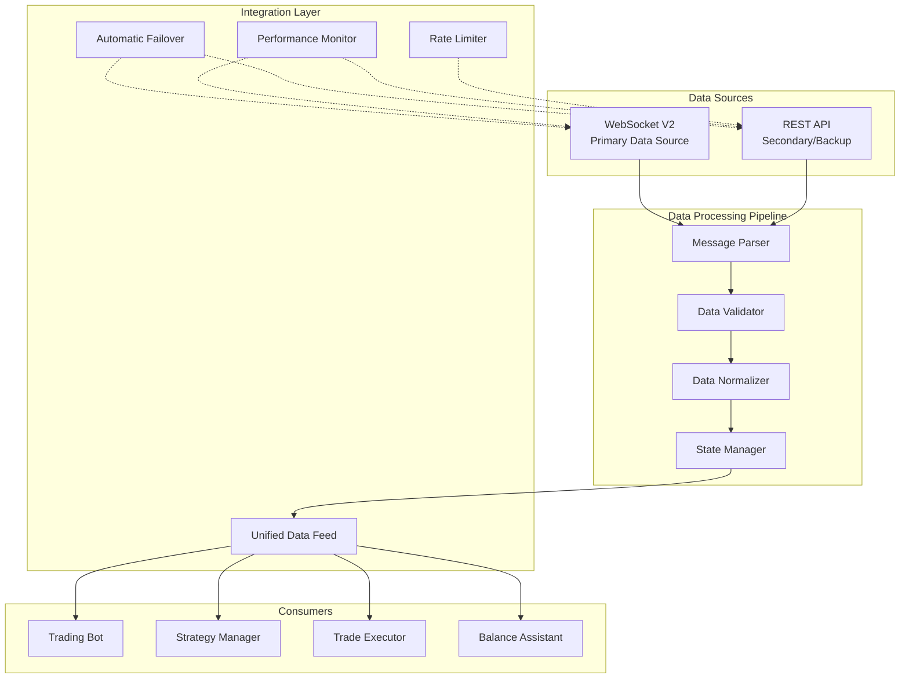

# WebSocket V2 & REST API Data Handling Architecture

## Executive Summary

This architecture maximizes WebSocket V2 capabilities for real-time data streaming while strategically using REST API for supplementary operations. The design prioritizes low-latency data delivery, high availability, and fault tolerance.

## Architecture Overview



## 1. WebSocket V2 Primary System

### 1.1 Core Components

```python
# WebSocket V2 Manager Architecture
class EnhancedWebSocketV2Manager:
    """
    Primary data source for all real-time operations
    """
    
    def __init__(self):
        self.channels = {
            'balances': BalanceStreamHandler(),
            'ticker': TickerStreamHandler(),
            'ohlc': OHLCStreamHandler(),
            'book': OrderBookStreamHandler(),
            'executions': ExecutionStreamHandler(),
            'orders': OrderStatusHandler()
        }
        
        self.connection_pool = WebSocketConnectionPool(
            max_connections=3,  # Multiple connections for redundancy
            load_balancing='round_robin'
        )
        
        self.message_processor = MessageProcessor(
            parsers={
                'v2': WebSocketV2Parser(),
                'legacy': LegacyFormatParser()
            }
        )
```

### 1.2 Channel Subscription Strategy

```python
class ChannelSubscriptionManager:
    """
    Manages WebSocket channel subscriptions with priority
    """
    
    CHANNEL_PRIORITIES = {
        'balances': 1,      # Highest priority - account state
        'executions': 2,    # Trade executions
        'ticker': 3,        # Market prices
        'book': 4,          # Order book depth
        'ohlc': 5,          # Chart data
        'orders': 6         # Order status updates
    }
    
    async def subscribe_with_priority(self):
        """Subscribe to channels based on priority"""
        for channel, priority in sorted(
            self.CHANNEL_PRIORITIES.items(), 
            key=lambda x: x[1]
        ):
            await self.subscribe_channel(channel)
```

### 1.3 Real-time Data Handlers

```python
class BalanceStreamHandler:
    """
    Handles real-time balance updates from WebSocket V2
    """
    
    async def handle_message(self, data: List[Dict[str, Any]]):
        """
        Process balance updates with format:
        [{"asset": "MANA", "balance": "163.94", "hold_trade": "0"}]
        """
        formatted_balances = {}
        
        for item in data:
            asset = item.get('asset')
            free = Decimal(item.get('balance', '0'))
            used = Decimal(item.get('hold_trade', '0'))
            
            formatted_balances[asset] = {
                'free': free,
                'used': used,
                'total': free + used,
                'timestamp': time.time(),
                'source': 'websocket_v2'
            }
        
        # Push to unified data feed
        await self.data_feed.push_balance_update(formatted_balances)
```

### 1.4 Order Management via WebSocket

```python
class WebSocketOrderManager:
    """
    Manages order placement and tracking via WebSocket V2
    """
    
    async def place_order(self, order_params: Dict[str, Any]):
        """
        Place order through WebSocket for lowest latency
        """
        message = {
            'method': 'add_order',
            'params': {
                'symbol': order_params['symbol'],
                'side': order_params['side'],
                'order_type': order_params['type'],
                'order_qty': str(order_params['quantity']),
                'token': self.auth_token
            }
        }
        
        # Send order and track response
        response = await self.ws_client.send_and_wait(message)
        return self.process_order_response(response)
```

## 2. REST API Secondary System

### 2.1 Strategic REST API Usage

```python
class StrategicRESTClient:
    """
    REST API client for specific use cases only
    """
    
    ALLOWED_OPERATIONS = {
        'initial_snapshot': ['GET /Balance', 'GET /OpenOrders'],
        'historical_data': ['GET /OHLC', 'GET /Trades'],
        'validation': ['GET /SystemStatus', 'GET /AssetPairs'],
        'recovery': ['GET /Balance', 'GET/ClosedOrders'],
        'administrative': ['POST /WithdrawInfo', 'GET /DepositAddresses']
    }
    
    async def get_initial_snapshot(self):
        """Get initial data snapshot on startup"""
        snapshot = {
            'balances': await self.get_balance(),
            'open_orders': await self.get_open_orders(),
            'asset_pairs': await self.get_asset_pairs(),
            'timestamp': time.time()
        }
        return snapshot
```

### 2.2 REST API Circuit Breaker

```python
class RESTCircuitBreaker:
    """
    Circuit breaker specifically for REST API calls
    """
    
    def __init__(self):
        self.config = CircuitBreakerConfig(
            failure_threshold=3,
            rate_limit_threshold=1,  # Open immediately on rate limit
            timeout=300.0,  # 5 minutes for REST API
            half_open_requests=1
        )
        
    async def call_with_breaker(self, operation: str, *args, **kwargs):
        """Execute REST call with circuit breaker protection"""
        if self.is_open and operation not in ['GET /SystemStatus']:
            # Only allow system status checks when open
            raise CircuitBreakerOpenError("REST API circuit breaker is open")
        
        return await self.execute(operation, *args, **kwargs)
```

## 3. Data Processing Pipeline

### 3.1 Message Parser

```python
class UnifiedMessageParser:
    """
    Parses messages from both WebSocket and REST sources
    """
    
    def parse(self, message: Any, source: str) -> Dict[str, Any]:
        """Parse message based on source"""
        if source == 'websocket_v2':
            return self.parse_websocket_v2(message)
        elif source == 'rest_api':
            return self.parse_rest_response(message)
        
    def parse_websocket_v2(self, message: Dict) -> Dict[str, Any]:
        """Parse WebSocket V2 message format"""
        channel = message.get('channel')
        data = message.get('data', [])
        
        return {
            'channel': channel,
            'data': data,
            'timestamp': time.time(),
            'source': 'websocket_v2'
        }
```

### 3.2 Data Validator

```python
class DataValidator:
    """
    Validates data from all sources
    """
    
    def validate(self, data: Dict[str, Any]) -> ValidationResult:
        """Validate data structure and values"""
        validators = {
            'balance': self.validate_balance,
            'ticker': self.validate_ticker,
            'order': self.validate_order
        }
        
        data_type = data.get('type')
        if data_type in validators:
            return validators[data_type](data)
        
        return ValidationResult(valid=False, reason="Unknown data type")
```

### 3.3 State Manager

```python
class UnifiedStateManager:
    """
    Manages application state from all data sources
    """
    
    def __init__(self):
        self.state = {
            'balances': {},
            'tickers': {},
            'orderbooks': {},
            'orders': {},
            'positions': {}
        }
        
        self.state_history = StateHistory(max_entries=10000)
        self.state_lock = asyncio.Lock()
    
    async def update_state(self, update: Dict[str, Any]):
        """Update state with proper locking"""
        async with self.state_lock:
            update_type = update.get('type')
            data = update.get('data')
            
            if update_type == 'balance':
                self.update_balances(data)
            elif update_type == 'ticker':
                self.update_tickers(data)
                
            # Track state changes
            self.state_history.add_entry(update)
```

## 4. Integration Points

### 4.1 Unified Data Feed

```python
class UnifiedDataFeed:
    """
    Provides unified interface for all data consumers
    """
    
    def __init__(self):
        self.subscribers = {
            'balance': [],
            'ticker': [],
            'orderbook': [],
            'execution': []
        }
        
        self.data_sources = {
            'primary': WebSocketV2Manager(),
            'secondary': RESTAPIClient()
        }
        
    async def get_ticker(self, symbol: str) -> Dict[str, Any]:
        """Get ticker with automatic source selection"""
        # Try WebSocket first
        ticker = await self.data_sources['primary'].get_ticker(symbol)
        
        if not ticker or self.is_stale(ticker):
            # Fallback to REST if WebSocket data is stale
            ticker = await self.data_sources['secondary'].get_ticker(symbol)
            
        return ticker
```

### 4.2 Automatic Failover

```python
class AutomaticFailoverManager:
    """
    Manages automatic failover between data sources
    """
    
    def __init__(self):
        self.health_checker = HealthChecker()
        self.failover_state = 'primary'
        self.failover_history = []
        
    async def monitor_and_failover(self):
        """Monitor data sources and failover when needed"""
        while True:
            primary_health = await self.health_checker.check_websocket()
            
            if not primary_health.is_healthy and self.failover_state == 'primary':
                await self.failover_to_secondary()
            elif primary_health.is_healthy and self.failover_state == 'secondary':
                await self.restore_to_primary()
                
            await asyncio.sleep(5)  # Check every 5 seconds
```

### 4.3 Performance Monitor

```python
class PerformanceMonitor:
    """
    Monitors performance of both data sources
    """
    
    def __init__(self):
        self.metrics = {
            'websocket': {
                'latency': [],
                'throughput': 0,
                'errors': 0,
                'uptime': 0
            },
            'rest_api': {
                'latency': [],
                'calls': 0,
                'rate_limits': 0,
                'errors': 0
            }
        }
        
    async def track_websocket_message(self, message: Dict, latency: float):
        """Track WebSocket message performance"""
        self.metrics['websocket']['latency'].append(latency)
        self.metrics['websocket']['throughput'] += 1
        
        # Keep only last 1000 latency measurements
        if len(self.metrics['websocket']['latency']) > 1000:
            self.metrics['websocket']['latency'].pop(0)
```

## 5. Implementation Strategy

### 5.1 Startup Sequence

```python
async def startup_sequence():
    """
    Optimized startup sequence for the data handling system
    """
    # 1. Initialize REST client for initial data
    rest_client = StrategicRESTClient()
    initial_snapshot = await rest_client.get_initial_snapshot()
    
    # 2. Initialize state with REST data
    state_manager = UnifiedStateManager()
    await state_manager.initialize_from_snapshot(initial_snapshot)
    
    # 3. Start WebSocket connection
    ws_manager = EnhancedWebSocketV2Manager()
    await ws_manager.connect()
    
    # 4. Subscribe to channels with priority
    await ws_manager.subscribe_with_priority()
    
    # 5. Start monitoring and failover
    failover_manager = AutomaticFailoverManager()
    asyncio.create_task(failover_manager.monitor_and_failover())
    
    # 6. Initialize unified data feed
    data_feed = UnifiedDataFeed()
    await data_feed.start()
    
    return data_feed
```

### 5.2 Error Handling Strategy

```python
class ErrorHandlingStrategy:
    """
    Comprehensive error handling for both data sources
    """
    
    ERROR_ACTIONS = {
        'websocket_disconnect': 'reconnect_with_backoff',
        'websocket_auth_fail': 'refresh_token_and_reconnect',
        'rest_rate_limit': 'activate_circuit_breaker',
        'rest_nonce_error': 'reset_nonce_and_retry',
        'data_validation_fail': 'log_and_skip',
        'state_corruption': 'restore_from_checkpoint'
    }
    
    async def handle_error(self, error_type: str, error: Exception):
        """Handle errors based on type"""
        action = self.ERROR_ACTIONS.get(error_type, 'log_and_continue')
        
        if action == 'reconnect_with_backoff':
            await self.reconnect_with_exponential_backoff()
        elif action == 'refresh_token_and_reconnect':
            await self.refresh_auth_and_reconnect()
        elif action == 'activate_circuit_breaker':
            self.circuit_breaker.trip()
```

## 6. Performance Optimizations

### 6.1 Message Batching

```python
class MessageBatcher:
    """
    Batches messages for efficient processing
    """
    
    def __init__(self, batch_size: int = 100, batch_timeout: float = 0.1):
        self.batch_size = batch_size
        self.batch_timeout = batch_timeout
        self.pending_messages = []
        
    async def add_message(self, message: Dict):
        """Add message to batch"""
        self.pending_messages.append(message)
        
        if len(self.pending_messages) >= self.batch_size:
            await self.process_batch()
```

### 6.2 Data Compression

```python
class DataCompressor:
    """
    Compresses data for efficient storage and transmission
    """
    
    def compress_orderbook(self, orderbook: Dict) -> Dict:
        """Compress orderbook data"""
        return {
            'b': [[p, v] for p, v in orderbook['bids'][:10]],  # Top 10 bids
            'a': [[p, v] for p, v in orderbook['asks'][:10]],  # Top 10 asks
            't': orderbook['timestamp']
        }
```

## 7. Monitoring and Metrics

### 7.1 Key Performance Indicators

```python
class DataSystemMetrics:
    """
    Tracks key metrics for the data handling system
    """
    
    KPIs = {
        'websocket_uptime': 'percentage',
        'websocket_message_rate': 'messages_per_second',
        'rest_api_calls': 'calls_per_minute',
        'data_latency': 'milliseconds',
        'failover_count': 'count',
        'error_rate': 'errors_per_minute'
    }
    
    async def generate_report(self) -> Dict[str, Any]:
        """Generate performance report"""
        return {
            'websocket': {
                'uptime': self.calculate_uptime(),
                'message_rate': self.calculate_message_rate(),
                'avg_latency': self.calculate_avg_latency()
            },
            'rest_api': {
                'calls_today': self.rest_call_count,
                'rate_limits_hit': self.rate_limit_count,
                'avg_response_time': self.calculate_rest_response_time()
            }
        }
```

## 8. Security Considerations

### 8.1 Authentication Management

```python
class EnhancedAuthenticationManager:
    """
    Manages authentication for both WebSocket and REST
    """
    
    def __init__(self):
        self.websocket_token = None
        self.token_expiry = None
        self.refresh_threshold = 300  # 5 minutes before expiry
        
    async def maintain_authentication(self):
        """Proactively maintain authentication"""
        while True:
            if self.should_refresh_token():
                await self.refresh_websocket_token()
                
            await asyncio.sleep(60)  # Check every minute
```

## 9. Testing Strategy

### 9.1 Integration Tests

```python
class DataSystemIntegrationTests:
    """
    Integration tests for the data handling system
    """
    
    async def test_websocket_failover(self):
        """Test automatic failover to REST API"""
        # 1. Start with WebSocket
        # 2. Simulate WebSocket failure
        # 3. Verify failover to REST
        # 4. Verify data continuity
        
    async def test_data_consistency(self):
        """Test data consistency between sources"""
        # 1. Get data from WebSocket
        # 2. Get same data from REST
        # 3. Compare and validate consistency
```

## 10. Deployment Considerations

### 10.1 Configuration

```yaml
# config/data_system.yaml
websocket:
  endpoint: wss://ws-auth.kraken.com/v2
  channels:
    - balances
    - ticker
    - book
    - executions
  reconnect_interval: 5
  max_reconnect_attempts: 10

rest_api:
  base_url: https://api.kraken.com
  timeout: 15
  max_retries: 3
  rate_limit_buffer: 0.8  # Use only 80% of rate limit

performance:
  enable_compression: true
  batch_size: 100
  cache_ttl: 300
```

## Conclusion

This architecture provides a robust, scalable solution for handling real-time cryptocurrency trading data. By maximizing WebSocket V2 usage and strategically employing REST API only when necessary, the system achieves:

1. **Low Latency**: WebSocket V2 provides sub-second market data updates
2. **High Reliability**: Automatic failover ensures continuous operation
3. **Scalability**: Efficient data processing and caching reduce system load
4. **Fault Tolerance**: Circuit breakers and error handling prevent cascading failures
5. **Cost Efficiency**: Minimized REST API calls reduce rate limit consumption

The modular design allows for easy extension and modification as requirements evolve.